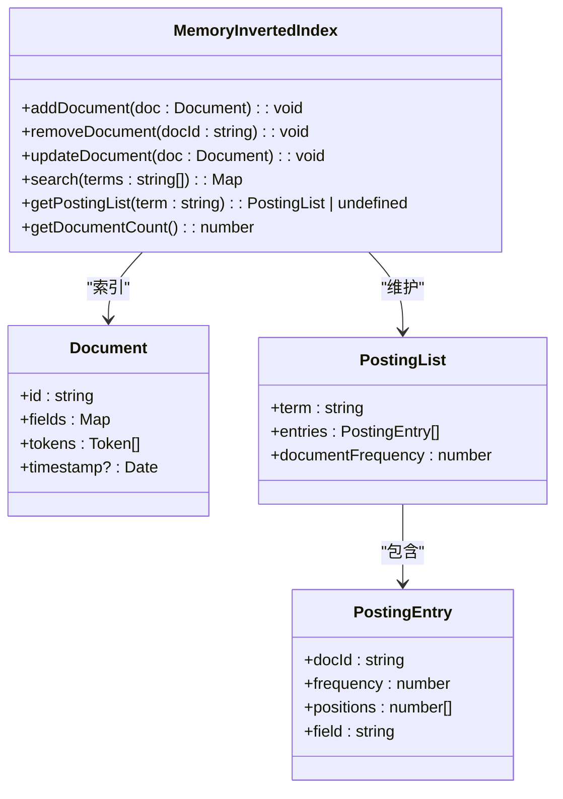

# 全文检索与空间数据

<cite>
**本文档引用的文件**
- [invertedIndex.ts](file://src/fulltext/invertedIndex.ts)
- [analyzer.ts](file://src/fulltext/analyzer.ts)
- [scorer.ts](file://src/fulltext/scorer.ts)
- [query.ts](file://src/fulltext/query.ts)
- [engine.ts](file://src/fulltext/engine.ts)
- [synapsedbExtension.ts](file://src/fulltext/synapsedbExtension.ts)
- [types.ts](file://src/fulltext/types.ts)
- [rtree.ts](file://src/spatial/rtree.ts)
- [geometry.ts](file://src/spatial/geometry.ts)
- [spatialQuery.ts](file://src/spatial/spatialQuery.ts)
- [integration.ts](file://src/fulltext/integration.ts)
</cite>

## 目录
1. [全文检索功能](#全文检索功能)
2. [空间查询功能](#空间查询功能)
3. [多模态复合查询](#多模态复合查询)
4. [功能验证与性能基准](#功能验证与性能基准)

## 全文检索功能

SynapseDB 的全文检索功能基于倒排索引（Inverted Index）实现，提供高效的文本搜索能力。系统通过分词器（Analyzer）对文档进行预处理，构建倒排索引，并使用 TF-IDF 和 Okapi BM25 等评分模型计算相关性。

### 倒排索引构建

倒排索引是全文检索的核心数据结构，它将文档中的词元（Term）映射到包含该词元的文档列表。在 `MemoryInvertedIndex` 类中实现了内存倒排索引：



**图示来源**
- [invertedIndex.ts](file://src/fulltext/invertedIndex.ts#L8-L85)
- [types.ts](file://src/fulltext/types.ts#L10-L100)

当添加文档时，系统会分析文档内容，提取词元并记录其在文档中的位置和频率。这些信息被组织成倒排列表（Posting List），存储在内存映射中。

### 分词器配置

分词器负责将原始文本分解为有意义的词元。系统提供了多种分词器实现，可通过 `FullTextConfig` 配置：

```mermaid
classDiagram
class TextAnalyzer {
<<interface>>
+analyze(text : string, language? : string) : Token[]
+normalize(text : string) : string
+generateNGrams(tokens : string[], n : number) : string[]
}
class StandardAnalyzer {
+analyze(text : string, language : string) : Token[]
+normalize(text : string) : string
+tokenize(text : string, language : string) : Token[]
+removeStopWords(tokens : Token[], language : string) : Token[]
+applyStemming(tokens : Token[], language : string) : Token[]
+generateNGramTokens(tokens : Token[]) : Token[]
}
class KeywordAnalyzer {
+analyze(text : string) : Token[]
+normalize(text : string) : string
}
class NGramAnalyzer {
+analyze(text : string) : Token[]
+normalize(text : string) : string
+generateCharNGrams(chars :
```