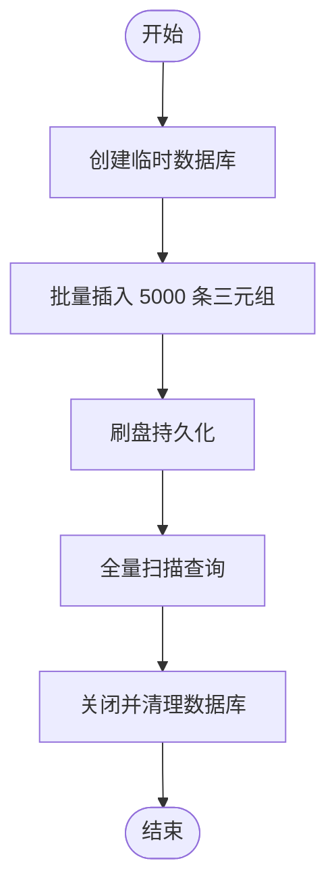
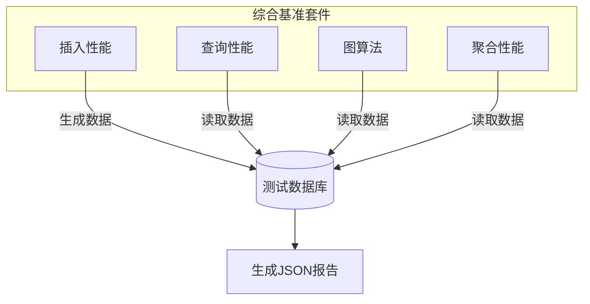

<docs>
# 性能基准与测试

<cite>
**本文档引用文件**  
- [basic.mjs](file://benchmarks/basic.mjs)
- [comprehensive.mjs](file://benchmarks/comprehensive.mjs)
- [insert_scan.mjs](file://benchmarks/insert_scan.mjs)
- [path_agg.mjs](file://benchmarks/path_agg.mjs)
- [framework.mjs](file://benchmarks/framework.mjs)
- [quick.mjs](file://benchmarks/quick.mjs)
- [bench-standard.mjs](file://scripts/bench-standard.mjs)
- [performance_baseline.test.ts](file://tests/performance/performance_baseline.test.ts)
- [performance_large_insert.test.ts](file://tests/performance/performance_large_insert.test.ts)
- [property_index_performance.test.ts](file://tests/performance/property_index_performance.test.ts)
- [synapseDb.ts](file://src/synapseDb.ts)
- [persistentStore.ts](file://src/storage/persistentStore.ts)
- [propertyIndex.ts](file://src/storage/propertyIndex.ts)
- [suites.ts](file://src/benchmark/suites.ts)
- [community.ts](file://src/algorithms/community.ts)
- [snapshot_memory_optimization.test.ts](file://tests/system/snapshot_memory_optimization.test.ts) - *在最近提交中更新*
</cite>

## 更新摘要
**变更内容**   
- 在“关键路径性能分析”部分新增了关于Louvain社区发现算法的说明，解释其行为变更及对性能测试的影响。
- 新增了对 `snapshot_memory_optimization.test.ts` 文件的引用，该文件重构了内存优化测试并采用新的临时目录管理方式。
- 保持原有文档结构和其余内容不变。

## 目录
1. [简介](#简介)
2. [基准测试脚本说明](#基准测试脚本说明)
3. [标准性能测试执行方法](#标准性能测试执行方法)
4. [报告指标解读](#报告指标解读)
5. [关键路径性能分析](#关键路径性能分析)
6. [性能调优建议](#性能调优建议)
7. [结论](#结论)

## 简介
SynapseDB 是一个高性能图数据库系统，支持大规模三元组存储、属性索引、复杂图查询和聚合操作。为确保其在不同硬件环境下的稳定性和可预测性，项目提供了完整的性能基准测试体系。

本文档旨在提供一套可复现的性能测试方法论，帮助开发者和用户理解系统的性能特征，识别潜在瓶颈，并根据实际应用场景进行针对性优化。通过标准化的测试流程和详尽的结果分析，用户可以在目标部署环境中获得真实可靠的性能预期。

## 基准测试脚本说明
项目 `benchmarks` 目录下提供了多种类型的基准测试脚本，用于评估不同工作负载下的系统表现。

### 基础写入吞吐量测试 (basic.mjs)
该脚本测量最基础的三元组插入性能和全表扫描效率。它创建一个临时数据库，批量插入 5000 条三元组（如 `u0 KNOWS v0`），然后执行一次全量扫描查询。



**测试重点**
- 小规模数据的写入延迟
- 内存到磁盘的同步效率
- 全表扫描的 I/O 性能

**代码路径**
- 插入逻辑: `db.addFact()` 批量调用
- 持久化: `await db.flush()`
- 查询: `db.find({ predicate: 'KNOWS' }).toArray()`

**相关文件**
- [basic.mjs](file://benchmarks/basic.mjs)

### 综合混合负载测试 (comprehensive.mjs)
这是最全面的性能套件，模拟了现实世界中典型的混合读写场景。它使用自定义的 `BenchmarkSuite` 框架，包含多个子套件：

1.  **数据插入性能测试**: 测试小、中、大规模数据集的插入速度及内存占用。
2.  **查询性能测试**: 覆盖精确查询、模式匹配、流式处理和链式联想等。
3.  **图算法性能测试**: 评估最短路径（BFS、双向BFS、Dijkstra）等核心图算法的执行效率。
4.  **聚合性能测试**: 测试 COUNT、AVG、SUM 等聚合函数以及流式聚合的性能。



**特点**
- 支持 GC 指标收集（需 `--expose-gc`）
- 包含预热运行和多次测量以提高准确性
- 输出详细的 JSON 格式报告，便于自动化分析

**相关文件**
- [comprehensive.mjs](file://benchmarks/comprehensive.mjs)
- [framework.mjs](file://benchmarks/framework.mjs)

### 扫描性能评估 (insert_scan.mjs)
此脚本专注于评估大规模插入后的查询性能，特别是扫描操作的效率。它允许通过命令行参数指定数据规模（默认 20,000 条）。

**测试流程**
1.  **插入**: 快速插入 N 条三元组（主语循环使用 1000 个 ID）。
2.  **刷盘**: 显式调用 `flush()` 将数据持久化。
3.  **全扫描**: 执行 `find({ predicate: 'KNOWS' })` 获取所有匹配记录。
4.  **过滤扫描**: 执行 `find({ subject: 'user1', predicate: 'KNOWS' })` 进行带条件的扫描。

该脚本清晰地分离了写入、持久化和读取阶段，有助于分析每个环节的耗时。

**相关文件**
- [insert_scan.mjs](file://benchmarks/insert_scan.mjs)

### 其他专用测试脚本
- **path_agg.mjs**: 专门测试变长路径查询和聚合管道的性能。
- **quick.mjs**: 快速验证脚本，用于开发过程中的即时性能检查。

## 标准性能测试执行方法
推荐使用 `scripts/bench-standard.mjs` 脚本来运行标准性能测试，因为它提供了一个简单且一致的测试流程。

### 执行步骤
1.  **准备环境**: 确保 Node.js 环境已安装，并克隆 SynapseDB 仓库。
2.  **编译项目**: 运行 `npm run build` 或 `pnpm build` 以生成 `dist` 目录下的编译文件。
3.  **运行脚本**: 在项目根目录下执行以下命令：
    ```bash
    node scripts/bench-standard.mjs <数据库路径> [--count=100000] [--limit=1000]
    ```
    - `<数据库路径>`: 指定要创建或使用的数据库文件路径（例如 `./test.db`）。
    - `--count`: 可选，指定要生成的三元组数量，默认为 100,000。
    - `--limit`: 可选，指定查询结果的返回条数限制，默认为 1,000。

### 示例输出
```text
生成数据 100000 条...
insert: 1234ms
flush: 567ms
pattern.query: 89ms
pattern.hits 1000
cypher.query: 234ms
cypher.hits 1000
```

该脚本会自动完成数据生成、持久化，并对比 PatternBuilder API 和 Cypher 查询引擎的性能。

**相关文件**
- [bench-standard.mjs](file://scripts/bench-standard.mjs)

## 报告指标解读
性能测试报告中的关键指标对于评估系统健康状况至关重要。

### QPS (Queries Per Second)
QPS 衡量系统每秒能够处理的查询请求数。在 `bench-standard.mjs` 中，可以通过总查询时间估算：
```
QPS = --limit 的值 / 查询耗时(秒)
```
例如，如果 `pattern.query` 耗时 89ms 返回 1000 条，则 QPS ≈ 1000 / 0.089 ≈ 11,236。

### 延迟分布
延迟是指从发出请求到收到响应所花费的时间。`comprehensive.mjs` 会记录每次测量的耗时。关注点包括：
- **平均延迟**: 所有运行时间的算术平均值。
- **P95/P99 延迟**: 95% 或 99%