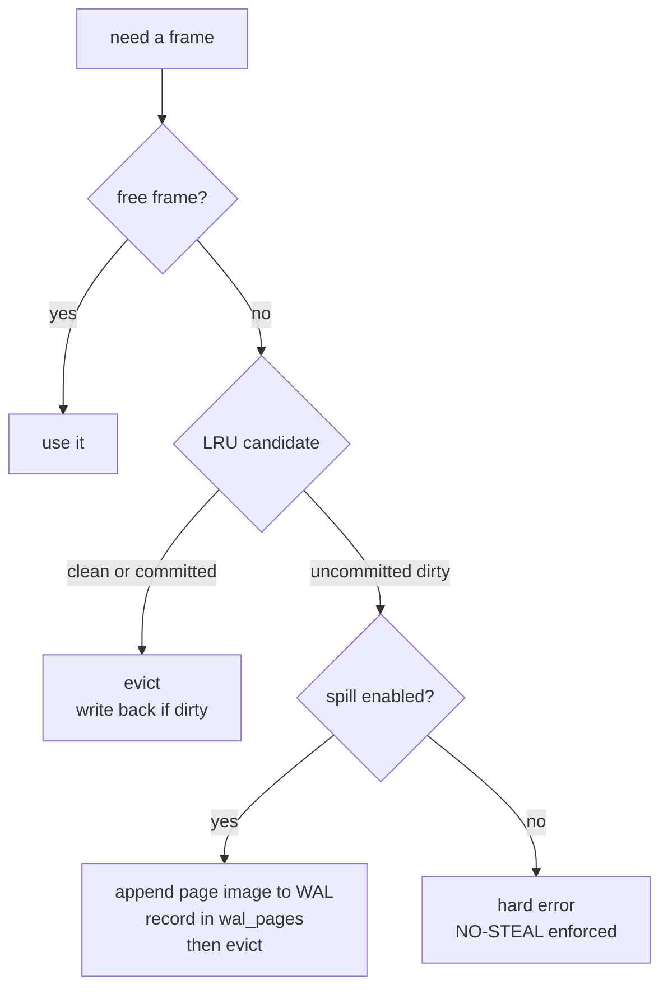
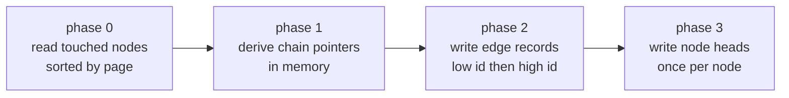

# Architecture

This is the detailed design reference. The [README](../README.md) covers what the
project is and how to use it; this document covers how it works.

The short version: NervusDB is an embedded property graph database that keeps
**all graph topology on disk** and bounds resident memory by a configurable buffer
pool. It stores two files — `{path}` and `{path}.wal` — and is built around
fixed-size records with direct physical addressing, the same way SQLite is built
around B-trees on 4KB pages.

For the invariants that any change must preserve, see
[AGENTS.md §1](../AGENTS.md). This document explains the reasoning behind them.

---

## 1. 4KB paging and the buffer pool

- The data file is divided into 4096-byte physical pages.
- `BufferPoolManager` holds a fixed number of frames (default 1024 = 4MB; 256 =
  1MB): LRU eviction, per-frame pin/unpin reference counting, and dirty-page
  tracking.
- Every graph operation pulls the pages it needs through the pool. Resident
  memory is bounded by the pool size rather than the dataset size (measured on a
  4.34 GB graph in a 1 GiB pool), so a graph far larger than RAM stays queryable.

Two details matter more than they look:

- **The replacer is O(1) per operation.** It is an intrusive doubly-linked list
  indexed by frame id. An earlier `VecDeque` implementation with linear scans was
  O(pool size) per page operation, which became the throughput ceiling at 16K
  frames: throughput there was an order of magnitude _below_ the 1024-frame case.
- **Page 0 and all page-directory pages are eviction-exempt.** Directory pages are
  traversed on every node/edge address resolution; letting data pages evict them
  forces the whole chain to be re-read.

## 2. Single-file storage and page-level WAL

The database is strictly two files:

| File         | Role                             |
| ------------ | -------------------------------- |
| `{path}`     | Data, partitioned into 4KB pages |
| `{path}.wal` | Page-level write-ahead log       |

No sidecar files: no `.lock`, no `.tmp`, no secondary index files. WAL frames are
`WalRecord::PageWrite { tx_id, page_id, crc32, data: 4KB }`.

Transactions commit to the WAL only. A checkpoint flushes dirty frames to
`{path}` and truncates the WAL. Crash recovery replays valid committed pages from
the WAL into `{path}`, and safely discards a torn trailing frame by CRC as well as
by the absence of a matching `TxCommit`.

## 3. STEAL spilling and transactional rollback

A transaction may mutate far more pages than the pool holds. When the pool fills
mid-transaction, uncommitted dirty pages are appended to the WAL as redo frames
and tracked in an in-memory page-location index (24 bytes per page, the same idea
as SQLite's wal-index).

Rollback is exact. Each page records a **baseline** location the first time the
transaction touches it; rolling back restores that location and reloads the page
image. Uncommitted redo frames stay in the WAL and are ignored by recovery
because they have no `TxCommit`, so **the main file is never polluted by
uncommitted data**.

`MIN_SPILL_FRAMES = 16` is the external-working-set floor. Below it, strict
NO-STEAL applies (an all-uncommitted-dirty exhaustion is a hard error), matching
SQLite's minimum page-cache policy.



<!-- Diagram: eviction decision path in acquire_frame() -->

## 4. Fixed-size records and disk-native adjacency

Two fixed layouts give O(1) physical addressing with no secondary page table:

| Record       | Size | Per 4KB page | Fields                                                                                                  |
| ------------ | ---- | ------------ | ------------------------------------------------------------------------------------------------------- |
| `NodeRecord` | 32 B | 128          | `in_use`, `label_id`, `first_outgoing_edge_id`, `first_incoming_edge_id`, `prop_ptr`, `inline_prop_val` |
| `EdgeRecord` | 64 B | 64           | `in_use`, `edge_type_id`, `prop_ptr`, `src_id`, `dst_id`, `weight`, `src_prev`, `src_next`, `dst_next`  |

$$ \text{PageId} = \text{BasePage} + \frac{N \times \text{sizeof(Record)}}{4096}, \quad
\text{Offset} = (N \times \text{sizeof(Record)}) \bmod 4096$$

Adjacency follows double-cyclic edge pointer chains across disk pages, read
through the buffer pool. Finding a node's neighbours never scans the graph.

## 5. Slotted property pages

Variable-length payloads do **not** get a page each — that layout is what made
40,000 entities occupy 162MB. Instead, several records are packed per page:

```
+--------------------------------------------------------------+
| Header 24B | Slot Array (grows down) | free | Payload (up)    |
+--------------------------------------------------------------+
```

- Each record is located by a 4-byte slot descriptor `[offset u16 | len u16]`;
  `len == 0` marks a dead slot.
- Deleting marks the slot dead; in-page compaction reclaims it when the page
  fills, and a fully drained page goes back to the `first_free_prop_page` list.
- Records at or below 1KB are inlined; larger ones chain into `PropertyPage`
  overflow pages, so an 11KB document still works.
- Payloads use `PropCodec` — varint count, length-prefixed keys, one-byte type
  tags, ZigZag integers — instead of `bincode(HashMap)` framing. That drops
  per-entity overhead from ~28 bytes to ~6. Property keys are deliberately **not**
  interned into `StringDict`, which would grow the header dictionary.

**Property pointers are packed**: 24 bits of `PageId` plus 8 bits of `SlotId`
(`0` = no properties, slot `0xFF` = overflow chain). The record layouts above are
unchanged, so addressing stays O(1).

Result: 40,000 entities with ~150-byte payloads occupy 7.90MB instead of 162MB, a
19.8× reduction.

## 6. Two-phase batch edge weaving

Per-edge insertion touches three pages per edge: the source node page, the target
node page, and the old chain head. When the graph's pages far exceed the pool,
the same page is evicted and re-read many times within one batch, and every miss
spills a full 4KB page to the WAL — a "false spill".

Edge batches with `EDGE_BATCH_WEAVE_MIN` (64) or more consecutive `AddEdge`
actions go through `insert_edges_batch` instead:


<!-- Diagram: the four phases of insert_edges_batch -->

Two subtleties that were bugs when missed:

- Position indexes are required, not optional. A linear scan per edge goes
  quadratic when many edges share one target.
- Phase 2 writes must not interleave low-id head fix-ups with high-id new
  records. They can be thousands of pages apart, and alternating between them
  thrashes the pool.

Chains come out identical to per-edge insertion: reverse insertion order, the
first in-batch edge linking to the pre-batch head, and that head's `src_prev`
rewritten. `tests/edge_locality_tests.rs` pins this equivalence.

**Admitted consequence:** ordering within a batch changes the *incoming* chain
order for a target with edges from several sources. Outgoing order is preserved
(ordering is per source node). Membership, edge contents and all analytics
results are identical.

## 7. Cypher execution

Lexer → recursive-descent parser → executor, over contexts that bind
`Binding::Node(u64) | Binding::Edge(u64) | Binding::Value(Value)`. Binding entity
kind explicitly is what prevents node ids and edge ids — which share a numbering
space — from being confused, and the `Value` variant carries `UNWIND` elements,
which are values rather than entities.

Pipeline:

```
MATCH  →  find_matches (per-pattern resolution + shared-variable join)
       →  WHERE
       →  SET  →  CREATE  →  DELETE
       →  projection (grouped aggregation)
       →  ORDER BY  →  SKIP  →  LIMIT

UNWIND  →  one row per list element  →  [CREATE]  →  projection (same pipeline)
MERGE   →  match the whole pattern  →  create it only if nothing matched
                                      →  ON CREATE / ON MATCH SET
```

`UNWIND` is why pattern property values are **expressions** rather than literals:
`CREATE (n {v: x})` has to read the variable `x` bound per row. `MATCH` and `MERGE`
pattern properties are therefore validated as literals at parse time — a pattern is
matched before any variable is bound, so an expression there could never be
evaluated, and silently matching nothing is indistinguishable from an empty graph.

`MERGE` matches or creates the pattern **as a whole**, using MATCH filter semantics
(named properties must be equal; extra properties on an existing node do not break
the match).

A statement that mutates takes the exclusive write lock and commits through the
WAL; a read-only one takes the shared lock, allowing concurrent readers.
`CypherStatement::is_mutating()` is the single source of truth for that routing —
and `MERGE` is unconditionally mutating, because whether it writes is only known
after matching.

A failed write statement is rolled back at statement granularity
(`rollback_failed_statement`), so a multi-record `UNWIND ... CREATE` that fails on
record 500 leaves none of the first 499 behind.

`RETURN *` expands from the variables actually present in the result bindings,
`count(*)` counts rows while `count(x)` counts non-null bindings, `sum` returns an
integer when every input is integral, and `avg` always returns a float.

## 8. Secondary index

- **Label index**: `Label -> BTreeSet<NodeId>`. Note the inverted index.
- **Property index**: `(Label, PropKey) -> BTreeMap<Value, BTreeSet<NodeId>>`,
  supporting both exact lookup and ordered range scans.

Queries that locate a start node by label or by an equality/range property
predicate consult the index first; a full scan is the fallback, not the default.
Indexes self-heal after property updates, label additions and failed
transactions, and rebuild on demand after a cold restart, so a stale index cannot
produce a phantom read.

## 9. Graph algorithms

All of these traverse disk adjacency cursors through the buffer pool; none
materialises a full adjacency map as persistent state.

| Algorithm | Notes |
| --- | --- |
| BFS shortest path | unweighted, fewest hops |
| Dijkstra | weighted |
| Cycle detection | three-colour DFS, with cycle enumeration |
| PageRank | damped iteration, configurable damping / iterations / tolerance, dangling mass redistributed, scores normalised to 1.0 |
| Weakly connected components | union-find, edges treated as undirected, largest component first |
| K-hop subgraph | BFS node dedup, direction and edge-type filter |

Every pointer traversal loop carries a `seen: HashSet<u64>` guard so a corrupted
or concurrently-mutated chain cannot spin forever.

## 10. Concurrency model

- Read queries and graph algorithms clone the lightweight `DiskGraph` handle and
  release the global read lock immediately, so a long traversal does not block
  writers for its whole duration.
- **Reads are serialized, not parallel, and this is measured.** The buffer pool is
  reached through a single `Arc<Mutex<BufferPoolManager>>`, so every page touch
  acquires one global mutex — a `get_node` at least three times, plus once per
  incident edge (degree 343 ⇒ ≈345 acquisitions, before the collapses described
  below). `get_node` now takes the mutex **once** whatever the degree; what remains is
  the single global mutex, not the acquisition count. On com-DBLP, 16 threads doing
  plain point reads achieved **0.6×–1.4% of single-thread throughput**: adding
  threads made reads *slower*. Control runs in the same process (pure CPU spin, and
  a loop taking only the outer read lock) both scaled to ≈40% at 16 threads, so the
  collapse is attributable to the buffer-pool mutex rather than to the machine.
  Numbers and method: [benchmarks.md](benchmarks.md#concurrency-scaling).
- `BufferPoolManager::latch` is dead code (declared, never used); there is no
  page-level latching. See ROADMAP item 1.
- Exactly **one handle per database file**, process-wide and across processes.
  See §11 for why.
- `Transaction` is a write-side object: it buffers actions, resolves edge chains
  in memory at commit, and issues a single `fsync` for the whole batch.
- **`NervusDb::read_snapshot()`** pins one consistent state for the lifetime of the
  returned guard. It exists because single calls are not enough: `get_node` and
  `get_edge` each take and release the read lock, so a traversal that reads an
  adjacency list and then fetches each named edge can stitch together two states and
  observe an edge that a concurrent delete removed in between. The snapshot closes
  that correctness gap — it does **not** add parallelism.
- A snapshot **blocks writers** while it lives, so keep it short, and never call a
  write entry point while holding one (it would wait on the lock the snapshot itself
  holds).
- The transaction action queue is **bounded** (`DEFAULT_MAX_TRANSACTION_ACTIONS`), since
  a transaction holds every action in memory until commit at ≈502 bytes per node action
  and 128 bytes per edge action. Overflow is an error, never an automatic flush:
  flushing mid-transaction would commit part of it and destroy the rollback guarantee.
- **An over-cap transaction is opt-in**, via
  `NervusDbOptions::spill_transaction_actions`. Overflow then writes actions to the WAL
  as `ActionWrite` frames and keeps an 8-byte location index each — the STEAL pattern,
  applied to actions instead of pages. Two consequences follow, and both are enforced
  rather than documented only: `Checkpoint` is **refused** while any transaction has
  spilled (it truncates the WAL), and a deferred *automatic* checkpoint does not fail
  the commit that triggered it, because that commit is already durable and a failure
  return would invite a duplicated retry. See `FORMAT.md` for the frame.

## 11. Production safety

Three defects made the engine unsafe outside the happy path. All three were
reproduced before being fixed, and each has a test that fails if it returns.

**Exclusive open.** Without it, two handles on one file both reported success and
the second write was silently lost (measured: two writers, one surviving node,
zero errors). `open` now takes an exclusive lock on `{path}` via
`std::fs::File::try_lock` — stable since Rust 1.89, so no new dependency, and no
sidecar file. The lock is acquired **before** WAL replay, because replay writes
the main file; locking afterwards would already have raced.

**Integrity checking.** Every data page carries a CRC32 (see section 13), and
`integrity_check()` sweeps them before any content check, naming the bad pages.
Beyond that, structural validation is what exists. `integrity_check()` is read-only and never repairs.
Its core is a **degree-conservation oracle**: chain degree measured by walking the
on-disk pointers must equal expected degree measured by independently scanning the
edge id space. Deriving both sides from one traversal would be self-confirmation,
not a check — the first implementation did exactly that and caught only
count mismatches.

**No silent read errors.** `get_node` used `.ok().flatten()`, collapsing storage
errors into `None` — which is why corruption looked like "node missing". Those
accessors are now documented as lossy, and `try_get_node` / `try_get_edge` return
`Result`, reserving `Ok(None)` for genuine absence.

**Locks never abort the process.** 71 `.unwrap()` / `.expect("Lock poisoned")`
sites were replaced with the poison-recovering accessors in `src/sync_ext.rs`.
These locks guard rebuildable derived state (frame tables, allocator metadata),
not business invariants, so recovering beats turning a local failure into a
process abort.

## 12. Storage format versioning

`DB_PAGE_VERSION` is currently `5`, and **this is the frozen format** — see
`FORMAT.md` for the byte-level specification and the stability promise. Versions 1,
2 and 3 are **not readable**: `open` returns an explicit error directing you to
export with `.dump` and re-import. It never silently reinterprets an old file, and
the check runs before any write, including WAL replay.

The logical dump (`dump_cypher`) emits `CREATE` plus `SET`, so replaying into an
existing node **replaces** properties rather than appending, which makes it
idempotent and doubles as the migration path.

## 13. Page CRCs (introduced in version 3, current at version 5)

Version 2 checksummed WAL frames but not the pages already in `{path}`, so a bit
flip or a half-written page was read back as "not found" and the graph quietly
returned wrong answers. Version 3 covers every data page:

```text
Page 1 .. 255      inline CRC32 array in Page 0
                   (INLINE_CRC_OFFSET, 4 bytes per page)
Page >= 256        two-level CrcDirPage radix directory
                   (CRC_DIR_PAGE_OFFSET in Page 0 -> L1 -> L2)
```

A stored value of `0` means "not recorded" and the page is skipped, never
reported. That asymmetry is deliberate: after a crash, a page the engine never
got around to recording must not make the database refuse to open.

Checksums are computed lazily — on eviction, on flush, and during WAL replay —
so a page write in the hot path pays nothing.

Three details are load-bearing:

- **`CrcStore` bypasses `BufferPoolManager`.** Routing directory I/O through the
  pool creates the recursion `fetch_page -> acquire_frame -> evict_frame ->
  record CRC -> fetch_page`. The dependency direction is therefore
  `BufferPoolManager -> CrcStore -> DiskManager`, and `CrcStore` carries its own
  bounded 64-page cache (256 KB) holding directory metadata only.
- **`CrcStore` is the last writer of Page 0.** It owns both the inline CRC array
  and `crc_dir_root`. The checkpoint sequence is replay (recording CRCs) →
  `sync_header` (dirties the Page 0 frame) → `flush` (Page 0 reaches disk with the
  root) → `flush_crc` (overlays the inline array and root) → truncate WAL.
  Writing the header after `flush_crc` silently erases the checksums.
- **Directory pages are self-checksummed.** `self_crc` is sealed on every write
  and verified on every load. Without it, one corrupted L2 page would report
  every data page it covers as a mismatch — thousands of false positives naming
  innocent pages while the real culprit stayed hidden.

`integrity_check` sweeps all page checksums first and names the bad pages, then
runs the content-level checks. The sweep is O(file size) page reads, which is the
right trade for an explicitly-invoked probe but is not meant to run in a hot loop.

$$
