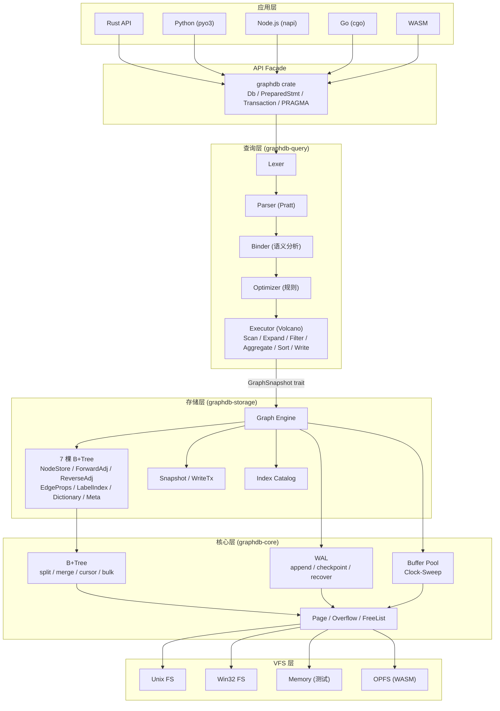

# 嵌入式图数据库架构设计 — "图数据库界的 SQLite"

> 基于 52 步第一性原理推演，完全独立于现有项目设计  
> 一句话描述：**"单文件、WAL 驱动、B+Tree 支撑的图数据库引擎，MVCC 快照隔离，~16K 行 Rust，通过 SQLite 兼容 C API 可从任何语言访问。"**

---

## 1. 设计原则

| #   | 原则             | 含义                                                           |
| --- | ---------------- | -------------------------------------------------------------- |
| 1   | **简洁优于巧妙** | 单文件、单 writer、规则优化器 — 每个选择都以简单性换理论最优性 |
| 2   | **图原生存储**   | 专用 Forward/Reverse 邻接 B+Tree，不是关系表上的图模拟         |
| 3   | **纵深防御**     | 每页 CRC32 + WAL fsync + 边界检查 + 7 层测试                   |
| 4   | **惰性一切**     | 延迟属性加载、按需反序列化、流式 Volcano 模型                  |
| 5   | **C API 为桥**   | prepare / step / finalize 模式，所有语言绑定基于 C API         |
| 6   | **模块纪律**     | 单文件 ≤1000 行、清晰 crate 边界、executor 按算子拆分          |
| 7   | **渐进交付**     | 6 阶段 MVP → 生产，TCK 持续度量                                |

---

## 2. 总架构



文件形态：`social.db`（主文件）+ `social.db-wal`（WAL 文件），**两个文件即全部**。

---

## 3. 文件格式

### 3.1 文件头 (100 字节)

| 偏移 | 大小 | 字段           | 说明                              |
| ---- | ---- | -------------- | --------------------------------- |
| 0    | 16   | Magic          | `"GraphDB-Embed\x00\x00\x00\x00"` |
| 16   | 4    | Format Version | 兼容版本 (u32)                    |
| 20   | 4    | Page Size      | 默认 4096 (u32)                   |
| 24   | 4    | Total Pages    | 文件大小 = pages × page_size      |
| 28   | 4    | FreeList Head  | 空闲页链表头                      |
| 36   | 8    | TxID HWM       | 事务 ID 高水位                    |
| 44   | 4    | Storage Epoch  | 主格式版本 (破坏性变更)           |
| 68   | 4    | Meta Page ID   | Meta B+Tree 根页                  |

### 3.2 页面格式 (公共 16 字节头)

```
[Page Header 16B][Page-specific content][Cell Content Area ↑]
```

- **Interior**: 右孩子指针 + Cell 指针数组 + (key, child_page) cells
- **Leaf**: 前驱/后继页指针 + Cell 指针数组 + (key, value) cells
- **Cell 指针间接寻址**: 插入只需追加 cell + 插入指针，无需移动数据

所有多字节值使用**大端序**，确保跨平台可移植 + 键天然字节序可比较。

---

## 4. 存储引擎 — 7 棵 B+Tree

| Tree ID | 名称              | Key                          | Value        | 用途                        |
| ------- | ----------------- | ---------------------------- | ------------ | --------------------------- |
| 0       | **Meta**          | string                       | u32/u64      | 系统元数据、计数器、根页    |
| 1       | **NodeStore**     | NodeId (u64 BE)              | NodeRecord   | 节点数据（标签 + 内联属性） |
| 2       | **ForwardAdj**    | (Src, RelType, Dst) 20B      | EdgeId (u64) | 出边邻接                    |
| 3       | **ReverseAdj**    | (Dst, RelType, Src) 20B      | EdgeId (u64) | 入边邻接                    |
| 4       | **EdgeProps**     | EdgeId (u64 BE)              | PropertyBlob | 边属性                      |
| 5       | **LabelIndex**    | (LabelId, NodeId) 12B        | ()           | 标签索引                    |
| 6       | **Dictionary**    | DictId (u32 BE)              | string       | 字符串驻留                  |
| 64+     | **PropIndex\_\*** | (LabelId, PropValue, NodeId) | ()           | 用户属性索引                |

### 键编码方案

- 整数：大端序保序（负数执行符号位翻转 XOR 0x80...）
- 字符串：UTF-8 + `\x00` 终结符
- 复合键：字段直接拼接，前缀扫描天然支持

### 图遍历性能

```
MATCH (a:Person)-[:KNOWS]->(b)

执行：ForwardAdj.scan_prefix(a.id, KNOWS_type_id)
     → 每叶页 ~130 条邻接记录
     → 10M 节点时 B+Tree 深度 ≈ 4 层

单跳展开：4 次页读取（首次）→ O(degree) 扫描
两跳展开：warm cache 下 ~20-40 次页读取
```

### 边存储分离策略

```
ForwardAdj: 只存 (src, rel, dst) → edge_id    ← 遍历热路径（85%）
EdgeProps:  edge_id → {since: 2020, role: "Lead"} ← 仅属性查询时访问

遍历不读属性 → 4K 页面装 ~130 条邻接 vs ~15 条（含属性时）
```

---

## 5. WAL + MVCC

### WAL 帧格式

```
[Frame Header 24B]
  page_number: u32
  db_size: u32
  tx_id: u64
  checksum: u32
  commit_flag: u32
[Page Data: 4096B]
```

### 事务模型

| 特性        | 设计                               |
| ----------- | ---------------------------------- |
| 隔离级别    | 快照隔离 (Snapshot Isolation)      |
| 并发模型    | 读者互不阻塞、Writer 不阻塞 Reader |
| Writer 数量 | 单 Writer（Mutex 序列化）          |
| 崩溃恢复    | 重放已提交 WAL 帧，丢弃未提交      |

```
Reader [TxID=100]: ────读────────────────── [end]
Writer:            [begin] ──修改── [commit TxID=106]
Reader [TxID=105]: ───────读──────────────── [end]

Reader@100 看不到 TxID=106 的变更（快照隔离）
```

### 检查点模式

| 模式     | 行为                   |
| -------- | ---------------------- |
| PASSIVE  | 尽量回写，不阻塞读者   |
| FULL     | 等待读者完成后全部回写 |
| TRUNCATE | FULL + 截断 WAL 文件   |

---

## 6. 查询引擎

### 5 阶段流水线

```
Cypher String → [Lexer] → Tokens → [Parser] → AST → [Binder] → 标注 AST
→ [Optimizer] → 逻辑计划 → [Executor] → Row Iterator（流式结果）
```

### Parser：Pratt 优先级

```
BP_OR=10 < BP_XOR=15 < BP_AND=20 < BP_NOT=25 < BP_CMP=30
< BP_ADD=40 < BP_MUL=50 < BP_UNARY=60 < BP_POW=70 < BP_PREFIX=80
```

### 8 条优化规则

| #   | 规则         | 效果                                 |
| --- | ------------ | ------------------------------------ |
| 1   | 谓词下推     | WHERE 条件尽早过滤                   |
| 2   | 标签优先扫描 | 用 LabelIndex 代替全节点扫描         |
| 3   | 索引选择     | WHERE 等值/范围走 PropIndex          |
| 4   | 展开方向     | `→` 用 ForwardAdj，`←` 用 ReverseAdj |
| 5   | 提前聚合     | 聚合后再展开可减少中间结果           |
| 6   | Limit 下推   | 减少不必要的计算                     |
| 7   | 冗余扫描消除 | 合并相同标签的扫描                   |
| 8   | 短路模式     | `RETURN count(n)` → 直接数索引条目   |

### Executor：Volcano 迭代器模型

每个算子实现 `open() / next() / close()` trait。算子按类型拆分为独立文件：

```
executor/
├── scan.rs       # NodeScan / LabelScan / IndexScan
├── expand.rs     # Expand / VarLengthExpand
├── filter.rs     # Filter
├── project.rs    # Projection
├── aggregate.rs  # HashAggregate
├── sort.rs       # Sort / TopN
├── join.rs       # HashJoin / CartesianProduct
├── write.rs      # Create / Delete / Set / Merge
└── misc.rs       # Unwind / Union / Distinct / Skip / Limit
```

---

## 7. API 设计 — SQLite 兼容

### C API (核心 FFI)

```c
// 生命周期
gdb_open(path, &db)     → gdb_close(db)

// 查询
gdb_prepare(db, cypher, &stmt)
gdb_bind_*(stmt, name, value)
gdb_step(stmt)           // 返回 GDB_ROW 或 GDB_DONE
gdb_column_*(stmt, col)
gdb_finalize(stmt)

// 事务
gdb_begin(db) → gdb_commit(db) / gdb_rollback(db)

// 便捷
gdb_exec(db, cypher)
```

### Rust API (高层)

```rust
let db = GraphDb::open("social.db")?;
let snap = db.snapshot();
let mut stmt = snap.prepare("MATCH (n:Person) WHERE n.age > $age RETURN n.name")?;
stmt.bind("age", 25)?;
for row in stmt.query()? {
    println!("{}", row.get::<&str>("n.name")?);
}
```

---

## 8. Crate 结构 + 代码量预估

```
graphdb/                     ~16,500 行源码 + ~50,000 行测试
├── graphdb-core/            ~4,200 行  (B+Tree / WAL / BufferPool / Page)
├── graphdb-storage/         ~3,300 行  (GraphEngine / CRUD / Snapshot / Key)
├── graphdb-query/           ~6,250 行  (Lexer / Parser / Binder / Optimizer / Executor)
├── graphdb/                 ~1,100 行  (Db facade / PreparedStmt / PRAGMA)
├── graphdb-c/               ~  500 行  (C FFI + graphdb.h)
├── graphdb-cli/             ~  800 行  (REPL + dot commands)
└── graphdb-py/              ~  400 行  (Python binding)
```

**每个文件 ≤1000 行**，彻底杜绝"上帝文件"问题。

---

## 9. 性能基准目标

| 操作             | 目标   | 备注                |
| ---------------- | ------ | ------------------- |
| 打开数据库       | <10ms  |                     |
| ID 点查          | <50μs  | 含缓冲池命中        |
| 单跳展开 (d=20)  | <100μs | ForwardAdj 前缀扫描 |
| 两跳展开 (d=20)  | <2ms   | 嵌套单跳            |
| 标签全扫 (100K)  | <20ms  | LabelIndex 顺序扫描 |
| 批量插入 1M 节点 | <2s    | 通过 WAL 顺序写入   |
| 空闲内存         | <5MB   | 2000 页缓冲池       |
| 二进制大小       | <2MB   |                     |

---

## 10. 测试策略 (7 层)

| 层       | 内容                                     | 量级            |
| -------- | ---------------------------------------- | --------------- |
| 单元测试 | B+Tree / WAL / Encoding / Lexer / Parser | >95% 行覆盖     |
| 集成测试 | 全 Cypher 子句端到端                     | 200+ case       |
| TCK 合规 | openCypher 官方测试套件                  | 4000+ scenarios |
| Fuzz     | 查询解析 / 存储格式 / WAL 恢复           | cargo-fuzz      |
| Chaos    | 随机崩溃 + 恢复验证                      | 1000+ 循环      |
| Soak     | 24h 连续读写                             | 监控无内存泄漏  |
| 属性测试 | B+Tree 不变量 / 编码往返                 | proptest        |

---

## 11. 实施路线图

| 阶段        | 目标               | 时长 | 交付                              |
| ----------- | ------------------ | ---- | --------------------------------- |
| **Phase 0** | B+Tree + PageCache | 4-6w | 可序列化 B+Tree + 1000 条测试     |
| **Phase 1** | 存储引擎 MVP       | 4-6w | ACID 读写 + WAL + 崩溃恢复        |
| **Phase 2** | 查询引擎 MVP       | 6-8w | 基础 Cypher (MATCH/CREATE/RETURN) |
| **Phase 3** | API + CLI          | 3-4w | Rust/C API + REPL + Python 绑定   |
| **Phase 4** | 优化 + 合规        | 6-8w | TCK ≥70% + 索引 + 完整 Cypher     |
| **Phase 5** | 生产就绪           | 4-6w | TCK ≥95% + Fuzz/Chaos/Soak        |
| **Phase 6** | 高级功能           | 持续 | 向量搜索 / FTS / WASM / 加密      |

**总计：28-38 周** (Phase 0-5，单人)

---

## 12. 与 NervusDB 对比（事后）

| 维度       | 本设计                      | NervusDB 现状                 |
| ---------- | --------------------------- | ----------------------------- |
| 存储       | 多 B+Tree + WAL (SQLite 式) | L0Run + CSR (LSM 式)          |
| 邻接查找   | O(log N) B+Tree 前缀扫描    | O(N) 线性扫描 (已知瓶颈)      |
| 最大文件   | ≤1000 行                    | executor.rs = 4687 行         |
| C API      | ✅ prepare/step/finalize    | ❌ 无                         |
| VFS 抽象   | ✅ 可插拔 I/O               | ❌ 无                         |
| PRAGMA     | ✅ SQLite 兼容              | ❌ 无                         |
| WASM       | ✅ 基于 VFS                 | ❌ 无                         |
| 文档       | — (设计阶段)                | ✅ 35+ 设计文档 (优秀)        |
| 测试基建   | — (设计阶段)                | ✅ TCK/Fuzz/Chaos/Soak (一流) |
| Trait 抽象 | GraphSnapshot (GAT)         | ✅ GraphSnapshot (GAT) — 一致 |

> [!NOTE]
> NervusDB 的测试基础设施、文档体系和 trait 设计都是优秀的。核心差距在于存储层的邻接查找性能和模块粒度控制。

---

## 13. 关键风险 (Top 8)

| 风险                   | 严重度 | 缓解                                    |
| ---------------------- | ------ | --------------------------------------- |
| B+Tree 正确性          | 致命   | 属性测试 + 与 std::BTreeMap 对照        |
| WAL 崩溃恢复           | 致命   | 逐字节注入测试 + 1000+ 崩溃循环         |
| TCK 合规性             | 高     | 分阶段攻克、按功能区域追踪              |
| 性能 vs Neo4j/Kùzu     | 高     | 积极预取 + 基准追踪 + 必要时 CSR 读路径 |
| 单文件大小限制         | 中     | u32 页计数 × 4K = 16TB（嵌入式足够）    |
| WASM 体积              | 中     | Feature flags + wasm-opt + LTO          |
| Cypher vs GQL 标准分化 | 中     | Parser 支持双方言切换                   |
| 长事务阻塞检查点       | 低     | 查询超时 + WAL 大小告警                 |
