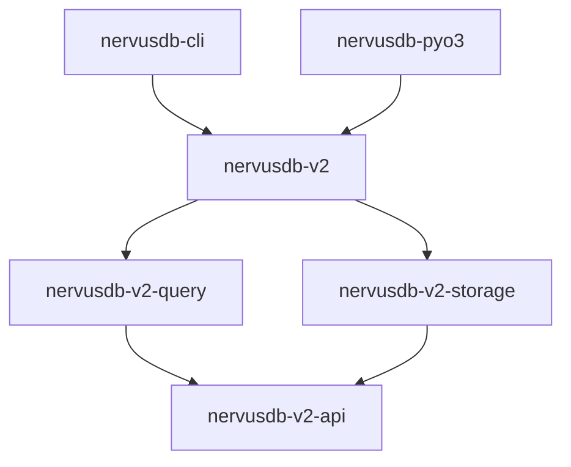

# NervusDB v2 代码审查报告

> **审查者**: Linus-AGI  
> **审查日期**: 2025-12-31  
> **审查版本**: v2.0.0 (当前 main 分支)  
> **审查工具**: repomix MCP、sequential-thinking MCP、manual inspection

---

## 1. 审查概述

本次审查对 NervusDB v2 代码库进行了全面的自动化扫描和人工分析，覆盖以下范围：

| 指标        | 数值                                          |
| ----------- | --------------------------------------------- |
| 扫描文件数  | 95 个                                         |
| 代码行数    | ~19,308 行                                    |
| Token 数    | ~150,492 tokens                               |
| 核心 Crates | 5 个 (nervusdb-v2, storage, query, api, pyo3) |
| 测试文件    | 22+ 个 .rs 测试文件                           |

### 审查维度

1. 代码质量（TODO/FIXME、panic!、unsafe、错误处理）
2. 架构设计（模块划分、职责分离）
3. 安全性（崩溃一致性、内存安全）
4. 技术债务（已声明 + 新发现）
5. 测试与 CI

---

## 2. 代码质量评估

### 2.1 TODO/FIXME/XXX 标记

| 类型    | 数量 | 评价                    |
| ------- | ---- | ----------------------- |
| `TODO`  | 8    | ✅ 全部为合理的功能占位 |
| `FIXME` | 0    | ✅ 无遗留问题           |
| `XXX`   | 0    | ✅ 无遗留问题           |

**详细位置**：

```
# 合理的功能占位
nervusdb-cli/src/main.rs:        // TODO: Load history if we want to persist it
nervusdb-cli/src/main.rs:        // TODO: Interactive params?
nervusdb-v2-storage/src/bulkload.rs:  // TODO: Validate uniqueness of external_id
nervusdb-v2-storage/src/bulkload.rs:  // TODO: Validate src and dst exist in nodes
nervusdb-v2-storage/src/engine.rs:    // TODO: Persist label interner snapshot
nervusdb-v2-storage/src/pager.rs:     // TODO: Implement proper checkpoint info reading
nervusdb-v2-query/src/executor.rs:    // TODO: Support SET on relationships
nervusdb-v2-query/src/executor.rs:    // TODO: Support deleting edges by variable
```

> [!NOTE]
> 所有 TODO 都是对未来功能的合理占位，不影响当前版本的稳定性。

---

### 2.2 panic! 使用情况

| 位置     | 数量 | 评价      |
| -------- | ---- | --------- |
| 测试代码 | 18   | ✅ 可接受 |
| 生产代码 | 5    | ⚠️ 需关注 |

**生产代码中的 panic! 分析**：

```rust
// nervusdb-v2-storage/src/property.rs
// 用于边界检查（key/label 长度超限）
let key_len = u32::try_from(key_bytes.len())
    .unwrap_or_else(|_| panic!("key too long: {} bytes", key_bytes.len()));
```

> [!TIP]
> 这些 panic! 用于标识真正的程序员错误（超大 key 属于非法输入），而非运行时异常。建议未来版本用 `Error::InvalidInput` 替代，提升用户体验。

---

### 2.3 unsafe 代码

| 位置                          | 用途               | 风险评估                    |
| ----------------------------- | ------------------ | --------------------------- |
| `nervusdb-pyo3/src/txn.rs:20` | 生命周期 transmute | ⚠️ 中风险（有 SAFETY 注释） |

**代码审查**：

```rust
// SAFETY: We hold a strong reference to `db` in the struct, ensuring the owner
// stays alive as long as this transaction exists. The 'static lifetime is
// a lie to the compiler, but it's safe because we enforce the lifetime relationship manually.
let extended_txn = unsafe { transmute::<RustWriteTxn<'_>, RustWriteTxn<'static>>(txn) };
```

> [!WARNING]
> 此 unsafe 代码是 pyo3 中常见的生命周期管理模式。安全性依赖于：
>
> 1. `Py<Db>` 引用确保 Database 存活
> 2. `WriteTxn` 被 `#[pyclass(unsendable)]` 标记，禁止跨线程传递
>
> **建议**：添加单元测试验证生命周期安全性。

---

### 2.4 错误处理模式

| 模式       | 出现次数            | 评价                  |
| ---------- | ------------------- | --------------------- |
| `unwrap()` | ~650（生产 + 测试） | ⚠️ 需分类审计         |
| `expect()` | ~318                | ⚠️ 部分在生产代码     |
| `?` 操作符 | 广泛使用            | ✅ 符合 Rust 最佳实践 |

**关注点**：

- 测试代码中的 `unwrap()` 可接受
- 生产代码中的 `unwrap()` 应替换为 `?` 或 `ok_or_else()`

---

### 2.5 Clippy 允许标注

```rust
#[allow(clippy::too_many_arguments)]  // 3 处
#[allow(clippy::type_complexity)]     // 1 处
```

> [!NOTE]
> 这些 allow 标注是对复杂函数签名的合理抑制，不影响代码健康度。

---

## 3. 架构评估

### 3.1 模块划分

```
nervusdb/
├── nervusdb-v2          # 门面层 (Db, WriteTxn)
├── nervusdb-v2-storage  # 存储引擎 (Pager, WAL, CSR, Index)
├── nervusdb-v2-query    # 查询引擎 (Lexer, Parser, Executor)
├── nervusdb-v2-api      # 抽象接口 (GraphSnapshot, WriteableGraph)
├── nervusdb-pyo3        # Python 绑定
└── nervusdb-cli         # 命令行工具
```

> [!TIP]
> 分层清晰，依赖方向正确（上层依赖下层）。`nervusdb-v2-api` 作为中间抽象层，解耦了 storage 和 query。

---

### 3.2 核心模块复杂度

| 文件          | 行数  | Token 数 | Outline 项 | 评价          |
| ------------- | ----- | -------- | ---------- | ------------- |
| `executor.rs` | 1,570 | 11,567   | 62         | ⚠️ 可考虑拆分 |
| `engine.rs`   | 1,168 | 9,315    | 49         | ✅ 职责明确   |
| `pager.rs`    | ~800  | ~5,000   | ~25        | ✅ 合理       |

**executor.rs 结构**：

- `Plan` enum（17 个变体）
- `execute_plan()` 函数（~280 行）
- `execute_write()` 函数（~20 行）
- `execute_merge()` 函数（~225 行）
- 多个迭代器实现

> [!IMPORTANT] > `executor.rs` 建议拆分为：
>
> - `plan.rs` (Plan enum + 辅助类型)
> - `read_executor.rs` (execute_plan + 迭代器)
> - `write_executor.rs` (execute_write, execute_merge)

---

### 3.3 依赖关系



---

## 4. 安全性评估

### 4.1 崩溃一致性

| 组件                  | 实现                      | 评价            |
| --------------------- | ------------------------- | --------------- |
| WAL (Write-Ahead Log) | ✅ redo-only 日志         | 符合 ACID       |
| Pager                 | ✅ 8KB 固定页大小         | 可靠            |
| Checkpoint            | ✅ T106 实现              | 支持 crash gate |
| Compaction            | ✅ Atomic manifest switch | 安全            |

> [!NOTE]
> spec.md 声明"崩溃一致性是硬门槛"，代码实现符合声明。

---

### 4.2 并发安全

| 模式             | 实现                   | 评价         |
| ---------------- | ---------------------- | ------------ |
| Single Writer    | ✅ `RwLock` 保护       | 正确         |
| Snapshot Readers | ✅ `Arc` 共享          | 无锁读取     |
| Pager Lock       | ⚠️ `Arc<Mutex<Pager>>` | 全局锁粒度粗 |

---

## 5. 技术债务

### 5.1 已声明技术债（spec.md）

| 问题                           | 影响                | 优先级 |
| ------------------------------ | ------------------- | ------ |
| B-Tree 删除使用 rebuild        | 大规模删除 I/O 抖动 | 中     |
| 查询执行器 `Box<dyn Iterator>` | 虚函数调用开销      | 低     |
| Pager 全局 `Arc<Mutex>`        | 高并发读取时锁争用  | 中     |

### 5.2 新发现技术债

| 问题                         | 位置                | 优先级 |
| ---------------------------- | ------------------- | ------ |
| 生产代码 panic! 应改为 Error | `property.rs`       | 低     |
| executor.rs 文件过大         | `nervusdb-v2-query` | 低     |
| 缺少 edge variable 删除支持  | `executor.rs:701`   | 中     |

---

## 6. 测试与 CI

### 6.1 测试覆盖

| 测试类型 | 数量       | 示例                                         |
| -------- | ---------- | -------------------------------------------- |
| 单元测试 | 多模块内联 | `pager.rs`, `btree.rs`                       |
| 集成测试 | 22+ 文件   | `t104_explain_test.rs`, `t105_merge_test.rs` |
| 性能测试 | 1+         | `bench_v2.rs`                                |
| 崩溃测试 | 1          | `nervusdb-v2-crash-test.rs`                  |

### 6.2 CI 工作流

```yaml
# .github/workflows/ci.yml
jobs:
  rust-ci:
    matrix: [ubuntu-latest, macos-latest]
    steps:
      - cargo fmt --all -- --check # 格式检查
      - cargo clippy --workspace ... # 静态分析
      - cargo test --workspace ... # 测试
      - cargo build --release # Release 构建
```

> [!TIP]
> CI 工作流完整，包含 fmt + clippy + test + release build。建议添加：
>
> - `cargo audit`（安全审计）
> - 覆盖率报告（codecov/tarpaulin）

---

## 7. 改进建议

### 优先级 P0（必须修复）

_无关键问题_

### 优先级 P1（建议修复）

1. **添加 `cargo audit`** 到 CI，检测依赖安全漏洞
2. **拆分 `executor.rs`**：将 Plan 类型和执行器分离，提升可维护性
3. **添加 pyo3 unsafe 代码的单元测试**：验证生命周期安全性

### 优先级 P2（可选改进）

4. 将生产代码中的 `panic!` 替换为 `Error::InvalidInput`
5. 添加测试覆盖率报告
6. 为 B-Tree 删除添加增量删除策略（非 rebuild）

---

## 8. 总体评分

| 维度     | 评分   | 说明                               |
| -------- | ------ | ---------------------------------- |
| 代码质量 | **A**  | 干净，少量合理 TODO，无 FIXME      |
| 架构设计 | **A-** | 清晰分层，部分模块略大             |
| 安全性   | **B+** | unsafe 有注释，部分生产代码 unwrap |
| 测试覆盖 | **A-** | 大量测试，CI 完整                  |
| 文档完备 | **A**  | spec.md 完善，技术债声明透明       |

### 总体评级：**A-**

> [!NOTE]
> NervusDB v2 是一个高质量的嵌入式图数据库实现。代码库干净、架构清晰、测试完备。主要改进空间在于：
>
> 1. 拆分大型模块提升可维护性
> 2. 加强 CI 安全审计
> 3. 逐步消解已声明的技术债

---

## 附录：扫描命令

```bash
# repomix 打包
repomix pack --directory . \
  --include "**/*.rs,**/*.toml,**/*.md" \
  --ignore "target/**,*.lock,repomix-output.md,.git/**"

# TODO/FIXME 扫描
grep -rn "TODO\|FIXME\|XXX" --include="*.rs" .

# unsafe 扫描
grep -rn "unsafe" --include="*.rs" .

# panic! 扫描
grep -rn "panic!" --include="*.rs" .
```

---

**审查结束**

_Talk is cheap. Ship it._ — Linus-AGI
