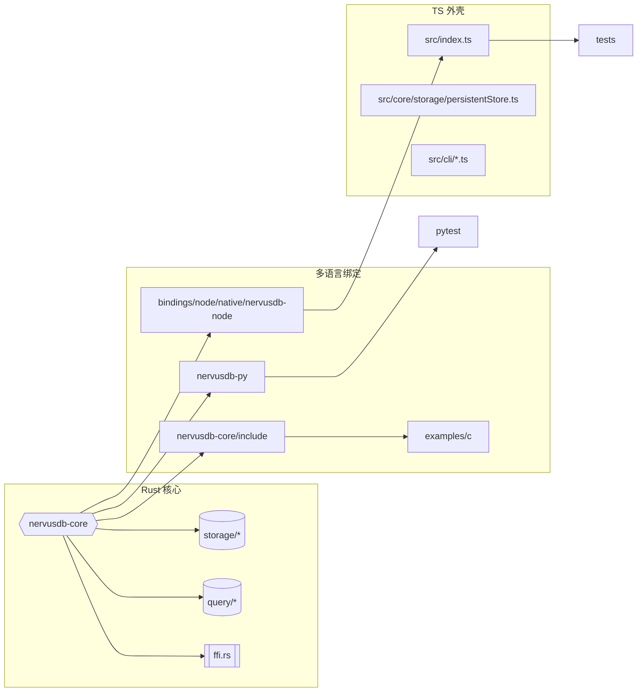
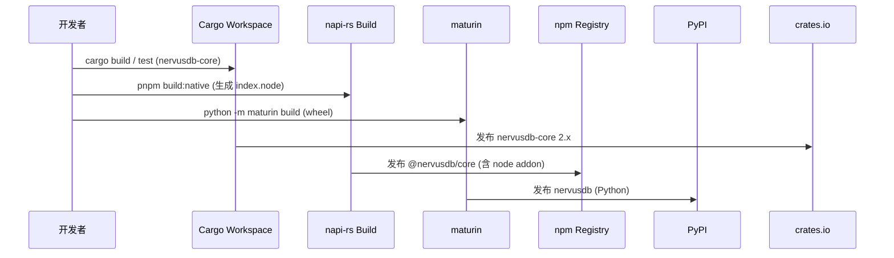

# NervusDB v2 项目组织架构

本文档以 Markdown 形式描述当前仓库在本地的整体结构与各子模块关系，便于对齐“Rust 核心 + 多语言绑定”的新架构方向。

## 1. 顶层目录概览

```
nervusdb/
├── nervusdb-core/          # Rust 核心数据库（存储、查询、FFI）
├── bindings/
│   ├── node/                # Node.js 包（TS 外壳 + N-API crate）
│   │   └── native/nervusdb-node/   # Rust N-API 模块
│   └── python/              # Python PyO3 绑定
├── nervusdb-py/            # Python PyO3 绑定
├── examples/c/             # C FFI 示例
├── docs/                   # 文档（本文件所在）
├── src/                    # TypeScript 外壳（包装 Rust 能力供 npm 用户使用）
├── tests/                  # Node 侧验证（BigInt、batch、系统测试等）
├── scripts/                # 构建、基准、检查脚本
└── package.json / Cargo.*  # npm 与 Cargo 配置入口
```

## 2. 模块交互图



## 3. 关键子系统说明

| 层级 | 位置 | 作用 | 主要产物 |
| --- | --- | --- | --- |
| Rust 核心 | `nervusdb-core/` | 实现 Hexastore、Redb 存储引擎、查询规划器、批量 API、FFI 接口 | `libnervusdb_core.a` / `libnervusdb_core_cdylib` |
| Node 绑定 | `bindings/node/native/nervusdb-node/` | 暴露 BigInt/Batch/Cursor 到 N-API，生成 `index.node` 供 npm 使用 | `native/nervusdb-node/npm/*.node` + `index.d.ts` |
| Python 绑定 | `nervusdb-py/` | 通过 PyO3 提供 `DatabaseHandle` 等 API，发布到 PyPI | `target/wheels/nervusdb-*.whl` |
| C FFI | `nervusdb-core/include/nervusdb.h` + `examples/c/` | 通过 `nervusdb_open` 等函数服务其他语言，实现最小可移植接口 | `libnervusdb_core` + C 头文件 |
| TypeScript 外壳 | `src/` | 维持 npm 包 API（`PersistentStore`, `NervusDB`），调用 Node 绑定驱动 Rust 核心 | `dist/index.mjs` / `dist/index.d.ts` |
| 测试 | `tests/`, `nervusdb-py/tests/`, `nervusdb-core/tests/` | 分别覆盖 Node BigInt+batch、Python API、Rust FFI 单测 | Vitest、Pytest、Cargo test |

## 4. 构建与发布链



## 5. 后续重构建议（摘录）

1. 将 `src/` 重定位到 `bindings/node/`，凸显其包装性质。
2. 统一使用 Cargo workspace 管理 `nervusdb-core`、`bindings/node/native/nervusdb-node`、`bindings/python/nervusdb-py`，减轻多套构建脚本维护成本。
3. CI 以 Rust 测试为主，Node/Python 绑定独立 job，避免历史 TypeScript 代码拖拽。
4. 未来文档/README 以 Rust 核心为首页，npm/PyPI 仅列为“官方绑定”。
