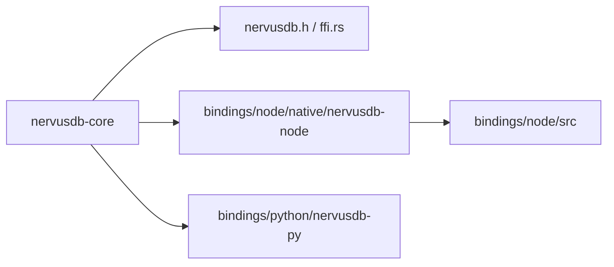

# NervusDB 仓库结构

这仓库已经完成“胖核心 / 薄绑定”的收敛：Rust 核心负责存储/查询/事务/FFI；各语言绑定只做参数转换与调用。

## 顶层目录

```
nervusdb/
├── nervusdb-core/                 # Rust 核心（redb 单文件存储、查询、算法、C FFI）
│   ├── src/
│   ├── include/nervusdb.h         # 公开 C 头文件（ABI 契约）
│   └── examples/                  # core benchmark / FFI 示例
├── bindings/
│   ├── node/                      # Node 包（TS 外壳 + N-API crate）
│   │   ├── src/                   # TS API（薄包装）
│   │   └── native/nervusdb-node/  # Rust N-API 模块（生成 .node）
│   └── python/                    # Python PyO3 绑定
├── nervusdb-wasm/                 # WASM 模块（单独构建）
├── examples/                      # 仓库级示例（含 C 示例）
├── docs/                          # 设计/任务/性能报告
├── _archive/                      # 旧世界代码与遗留文档（不进核心路径）
└── .github/workflows/             # CI + crash gate
```

## 模块关系（最短路径）



## 构建入口

```bash
# Rust core
cargo test --workspace

# Node binding
pnpm -C bindings/node install --frozen-lockfile
pnpm -C bindings/node build:native
pnpm -C bindings/node test:native
```
