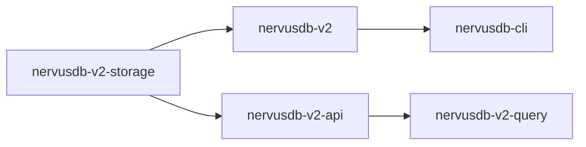

# NervusDB 仓库结构

这仓库收敛为 **v2 内核（Rust-first）**：存储/查询/CLI 都围绕 v2 的 `.ndb + .wal` 模型。

## 顶层目录

```
nervusdb/
├── nervusdb-v2-storage/           # v2 存储内核（pager/WAL/segments/compaction）
├── nervusdb-v2-query/             # v2 查询引擎（parser/planner/executor）
├── nervusdb-v2-api/               # v2 查询↔存储边界 trait
├── nervusdb-v2/                   # v2 facade（Db/ReadTxn/WriteTxn）
├── nervusdb-cli/                  # CLI（v2 write/query，NDJSON 输出）
├── docs/                          # 设计/任务/性能报告
├── _legacy_v1_archive/            # v1/redb 与旧绑定的归档（不参与 workspace/不再维护）
└── .github/workflows/             # CI + crash gate
```

## 模块关系（最短路径）



## 构建入口

```bash
# Rust (v2 workspace)
cargo test --workspace
```
