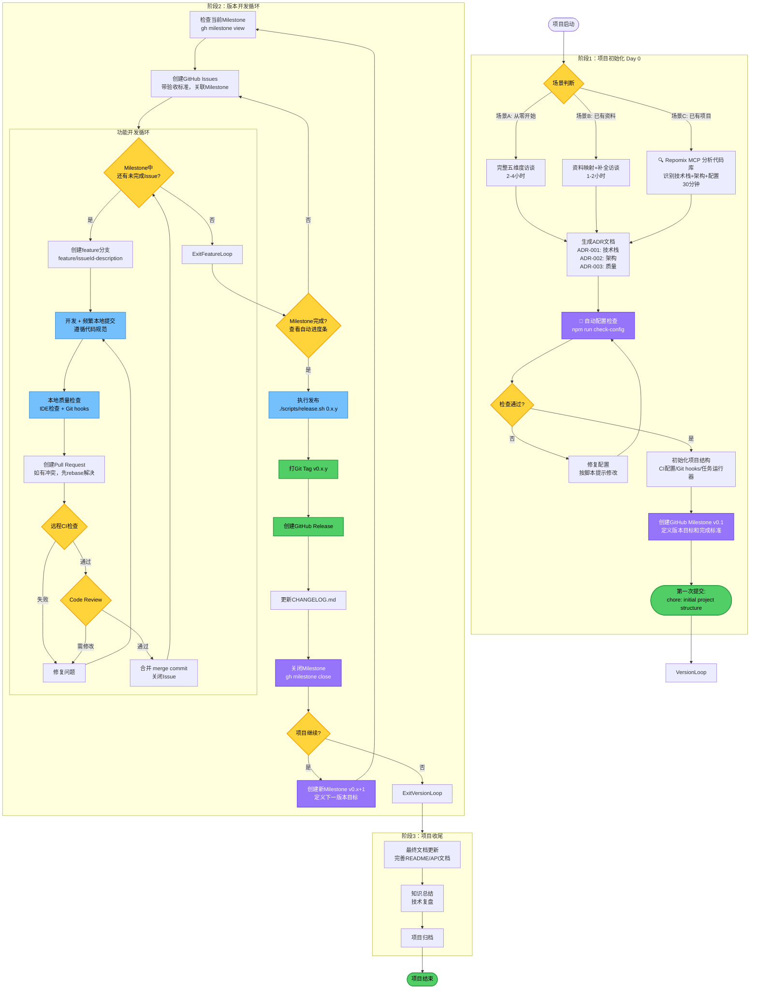
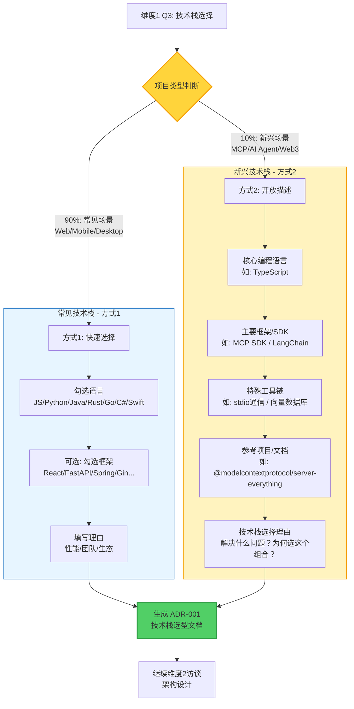
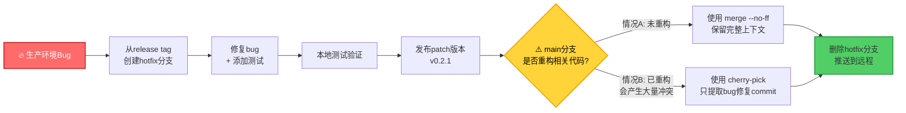

# 项目开发实施指南

> 完整的项目开发流程，从启动到发布的系统化实践指南

---

## 完整流程图



---

## 关键流程说明

### 0. 五维度访谈 - 技术栈选择策略（维度1 Q3）

**为什么需要混合选择方式？**

遵循 Linus 的实用主义哲学："不解决假想的问题，只解决真实的问题"。大多数项目（约90%）使用常见技术栈（Web后端、前端应用、移动应用等），可通过快速多选完成技术栈确认。但约10%的项目使用新兴或特殊技术（如 MCP 服务器、AI Agent、Web3、嵌入式），这些技术栈有独特的工具链和架构约束，无法用简单的"语言+框架"描述。

**设计原则**：避免为每个新技术创建单独的访谈模板（复杂度爆炸），而是让访谈本身具备灵活性。

#### 技术栈选择决策流程



#### 典型项目类型对照

| 项目类型           | 推荐方式 | 技术栈示例                     | 关键差异                                          |
| ------------------ | -------- | ------------------------------ | ------------------------------------------------- |
| **Web 后端 API**   | 方式1    | Python + FastAPI               | 勾选语言和框架即可，标准化程度高                  |
| **React 前端应用** | 方式1    | TypeScript + React + Vite      | 生态成熟，选项列表覆盖完整                        |
| **MCP 服务器**     | 方式2    | TypeScript + MCP SDK + stdio   | 需描述特殊工具：stdio通信、MCP Inspector调试      |
| **AI Agent**       | 方式2    | Python + LangChain + Chroma    | 需描述：向量数据库、Prompt版本控制、LangSmith追踪 |
| **移动应用**       | 方式1    | Kotlin + Jetpack Compose       | 框架选项已预定义                                  |
| **Web3 DApp**      | 方式2    | Solidity + Hardhat + Ethers.js | 需描述：智能合约工具链、测试网络、IPFS            |
| **嵌入式系统**     | 方式2    | C + FreeRTOS + HAL库           | 需描述：硬件抽象层、RTOS、调试器                  |

#### 实践建议

1. **默认先尝试方式1**：如果你的项目能在"语言选择"和"框架选择"的列表中找到匹配项，直接勾选即可。

2. **识别方式2的信号**：
   - ✅ 项目依赖特殊协议（如 MCP、gRPC、MQTT）
   - ✅ 需要特殊调试工具（如 MCP Inspector、LangSmith、Hardhat Console）
   - ✅ 技术栈包含"协议+SDK+工具链"组合，而非简单的"语言+框架"
   - ✅ 无法用一句话概括技术栈（如"就是个React应用" vs "基于stdio的MCP服务器"）

3. **方式2的核心价值**："参考项目/文档"字段
   - 帮助 AI 理解架构约束（如 MCP 必须用 stdio 通信）
   - 提供最佳实践参考（如 LangChain 官方模板的目录结构）
   - 避免违反协议规范（如 MCP 的 JSON-RPC 格式要求）

4. **两种方式的ADR输出一致**：无论用哪种方式，最终都生成标准化的 ADR-001 文档，包含技术栈选择和理由。

---

### 1. GitHub Milestone 版本管理

使用 GitHub Milestone 管理版本规划，自动追踪进度。

**创建版本 Milestone：**

```bash
# 创建第一个版本的 Milestone
gh milestone create "v0.1.0" \
  --description "核心目标：
  1. 用户认证功能
  2. 数据导入导出

  完成标准：
  - 所有P0 bug修复
  - CI通过率 >95%
  - 核心API文档完成" \
  --due-date "2025-02-15"
```

**创建 Issue 并关联 Milestone：**

```bash
gh issue create \
  --title "实现OAuth2登录" \
  --body "实现Google/GitHub OAuth2登录流程" \
  --milestone "v0.1.0" \
  --label "p1,enhancement"
```

**查看 Milestone 进度：**

```bash
# 列出所有 Milestone 及进度
gh milestone list
# 输出: v0.1.0  7/10 (70%)  Feb 15, 2025

# 查看具体 Milestone 的所有 Issue
gh milestone view "v0.1.0"
```

**版本完成后：**

```bash
# 关闭当前 Milestone
gh milestone close "v0.1.0"

# 创建下一个版本
gh milestone create "v0.2.0" \
  --description "下一版本目标..." \
  --due-date "2025-03-30"
```

---

### 2. 配置自动检查

在 Day 0 项目初始化时，运行自动检查脚本确保配置完整。

**创建检查脚本：`scripts/check-config.sh`**

```bash
#!/bin/bash
set -e

echo "🔍 检查配置完整性..."

# 检查1: .prettierignore 存在
if [ ! -f .prettierignore ]; then
  echo "❌ .prettierignore 不存在"
  exit 1
fi
echo "✅ .prettierignore 存在"

# 检查2: 格式化命令覆盖整个项目
FMT_CMD=$(grep -A 1 '"fmt"' package.json | tail -n 1)
if [[ ! $FMT_CMD =~ "\*\*/\*" ]]; then
  echo "❌ 格式化命令应使用 **/* 而非 {src}/**/*"
  exit 1
fi
echo "✅ 格式化命令覆盖整个项目"

# 检查3: lint-staged 路径匹配 tsconfig.json
if [ -f tsconfig.json ] && [ -f .lintstagedrc.json ]; then
  echo "✅ lint-staged 配置存在"
fi

# 检查4: Git hooks 配置
if [ -f .husky/pre-commit ] || [ -f .git/hooks/pre-commit ] || [ -f .pre-commit-config.yaml ]; then
  echo "✅ Git hooks 配置完整"
else
  echo "❌ Git hooks 配置缺失"
  exit 1
fi

# 检查5: CI 配置
if [ -f .github/workflows/ci.yml ]; then
  echo "✅ CI 配置文件存在"
else
  echo "❌ CI 配置文件缺失"
  exit 1
fi

echo ""
echo "🎉 所有配置检查通过！"
```

**在 package.json 中添加：**

```json
{
  "scripts": {
    "check-config": "./scripts/check-config.sh"
  }
}
```

**使用方式：**

```bash
# 初始化项目后运行
npm run check-config

# 如果失败，按提示修复，再次运行
```

---

### 3. 质量检查流程

**两层防护体系：**

```
Layer 1: 本地快速检查
  - IDE 实时检查
  - pre-commit: fmt + lint (<5秒)
  - pre-push: 快速类型检查 (<30秒)

Layer 2: 远程完整检查
  - 完整 CI: fmt + lint + test + build
```

**工作流：**

1. **开发时**：IDE 实时检查语法错误和类型问题
2. **提交时**：Git pre-commit hook 自动格式化和 lint
3. **推送前**：Git pre-push hook 运行快速类型检查
4. **PR 创建后**：远程 CI 运行完整测试套件

---

### 4. 异常场景处理

#### 4.1 合并冲突处理

**场景：** 创建 PR 时提示"存在冲突，无法自动合并"

这是多人协作中的常见场景：你的 feature branch 开发了 2-3 天，期间 main 分支有其他 PR 合并，导致代码冲突。

**解决步骤：**

```bash
# 步骤 1: 切换到你的 feature 分支
git checkout feature/42-user-auth

# 步骤 2: 同步 main 分支的最新代码（使用 rebase 保持历史整洁）
git pull --rebase origin main

# 步骤 3: 如果有冲突，Git 会提示冲突文件
# Auto-merging src/auth.ts
# CONFLICT (content): Merge conflict in src/auth.ts

# 步骤 4: 打开冲突文件，手动解决冲突
# 查找 <<<<<<< HEAD 和 >>>>>>> 标记
# 保留需要的代码，删除冲突标记

# 步骤 5: 标记冲突已解决
git add src/auth.ts

# 步骤 6: 继续 rebase
git rebase --continue

# 步骤 7: 推送到远程（需要 force，因为 rebase 改变了历史）
git push --force-with-lease origin feature/42-user-auth
```

**最佳实践：**

- ✅ **Feature branch 生命周期不超过 2-3 天**：长期分支容易累积冲突
- ✅ **每天同步 main**：`git pull --rebase origin main`，及早发现冲突
- ✅ **大功能拆分为多个小 Issue**：符合 Linus 的"简洁"哲学
- ✅ **使用 `--force-with-lease`**：比 `--force` 更安全，不会覆盖别人的推送

#### 4.2 Hotfix 紧急修复流程

**场景：** 生产环境 v0.2.0 发现严重 bug，而 main 分支已有 v0.3.0 的新功能（不能直接发布）

这是向后修复的真实场景，Linux 内核的稳定版本维护就是这样做的。

**Hotfix 流程图：**



**详细步骤：**

```bash
# 步骤 1: 从有问题的 release tag 创建 hotfix 分支
git checkout -b hotfix/0.2.1 v0.2.0

# 步骤 2: 修复 bug
# 编辑代码...
git add src/data-handler.ts
git commit -m "fix: prevent data loss in edge case (Fixes #123)"

# 步骤 3: 添加测试，避免 bug 重现
git add tests/data-handler.test.ts
git commit -m "test: add test case for data loss scenario"

# 步骤 4: 本地验证修复
npm run test
npm run build

# 步骤 5: 推送 hotfix 分支
git push origin hotfix/0.2.1

# 步骤 6: 发布 patch 版本（使用 release 脚本）
./scripts/release.sh 0.2.1

# 步骤 7: 🔴 关键步骤：将修复合并回 main（根据情况选择）

# 情况A：main分支未重构相关代码（推荐使用merge）
git checkout main
git pull origin main
git merge hotfix/0.2.1 --no-ff  # 使用 merge commit 保留上下文
git push origin main

# 情况B：main分支已重构，直接merge会产生大量冲突（使用cherry-pick）
git checkout main
git pull origin main
git log hotfix/0.2.1  # 找到bug修复的commit hash
git cherry-pick <commit-hash>  # 只提取bug修复commit
# 如果有冲突，手动解决后：
# git add .
# git cherry-pick --continue
git push origin main

# 步骤 8: 删除 hotfix 分支（任务完成）
git branch -d hotfix/0.2.1
git push origin --delete hotfix/0.2.1
```

**为什么必须合并回 main？**

如果不合并，main 分支仍然包含旧 bug，下次发布 v0.3.0 时 bug 会重现。这违反了 Linus 的"Never break userspace"原则。

**如何选择合并策略？**

**情况A（使用 merge --no-ff）**：

- ✅ main分支未重构bug相关的代码
- ✅ 代码结构基本一致，只是版本号不同
- ✅ merge能顺利进行，冲突少或无冲突
- 优势：保留完整的hotfix上下文（commit历史）

**情况B（使用 cherry-pick）**：

- ⚠️ main分支已重构bug相关模块（为了v0.3.0新功能）
- ⚠️ 代码结构完全改变，直接merge会产生巨大冲突
- ⚠️ merge后需要大量手动解决冲突
- 优势：只提取bug修复逻辑，避免merge冲突噩梦

**判断方法**：

```bash
# 先尝试merge（在本地测试分支）
git checkout -b test-merge main
git merge hotfix/0.2.1 --no-ff

# 如果冲突文件少（<3个）且容易解决 → 使用情况A
# 如果冲突文件多（>5个）或代码结构完全不同 → 使用情况B

# 清理测试分支
git checkout main
git branch -D test-merge
```

**真实案例**：

- v0.2.0 的 `auth.ts` 有 bug（100行）
- main 为了 v0.3.0 重构为 `auth/` 目录（5个文件，500行）
- 直接 merge：冲突涉及整个认证模块
- cherry-pick：只提取1个commit的bug修复逻辑（5行改动）

**Hotfix vs Feature 的区别：**

| 特性         | Feature Branch             | Hotfix Branch              |
| ------------ | -------------------------- | -------------------------- |
| **起点**     | 从 `main` 创建             | 从 `release tag` 创建      |
| **目标**     | 添加新功能                 | 修复生产环境 bug           |
| **生命周期** | 2-3 天                     | 数小时（紧急）             |
| **版本号**   | 下一个 minor 版本 (v0.3.0) | 下一个 patch 版本 (v0.2.1) |
| **合并方向** | `feature` → `main`         | `hotfix` → `main` + 发布   |

**GitHub Milestone 关联：**

Hotfix 通常不关联 Milestone（因为是紧急修复），但应该：

- 创建 Issue 记录 bug 和修复过程（便于追溯）
- 使用 `Closes #issue-number` 关联到 bug 报告

---

### 5. Git Hooks 配置方案

提供三种方案，根据项目特点选择：

#### 方案 1: 原生 Git Hooks（零依赖，高性能）

**适用场景：**

- 小型团队或个人项目
- 追求最小依赖和简洁配置
- 对性能有要求的项目

**创建 `.git/hooks/pre-commit` 文件：**

```bash
#!/usr/bin/env sh
# Git pre-commit hook - 自动格式化暂存的文件

echo "🔍 正在检查暂存文件..."

# 获取所有暂存的文件（只包括添加和修改的文件）
STAGED_FILES=$(git diff --cached --name-only --diff-filter=ACM | grep -E '\.(js|ts|jsx|tsx|vue|json|md|yaml|yml|css|scss|less|html|py|go|rs|java|kt)$')

if [ -z "$STAGED_FILES" ]; then
    echo "没有需要格式化的文件"
    exit 0
fi

echo "正在格式化以下文件:"
echo "$STAGED_FILES"

# 将文件列表转换为数组并逐个格式化
echo "$STAGED_FILES" | while IFS= read -r file; do
    if [ -f "$file" ]; then
        # 根据包管理器选择运行方式
        if command -v bunx &> /dev/null; then
            bunx prettier --write "$file"
        elif command -v pnpm &> /dev/null; then
            pnpm exec prettier --write "$file"
        else
            npx prettier --write "$file"
        fi
        git add "$file"
    fi
done

echo "✅ 代码格式化完成"
exit 0
```

**赋予执行权限：**

```bash
chmod +x .git/hooks/pre-commit
```

**多语言项目支持：**

```bash
#!/usr/bin/env sh

echo "🔍 正在格式化代码..."

STAGED_FILES=$(git diff --cached --name-only --diff-filter=ACM)

# JavaScript/TypeScript 文件使用 Prettier
JS_FILES=$(echo "$STAGED_FILES" | grep -E '\.(js|ts|jsx|tsx|vue|json|md)$')
if [ -n "$JS_FILES" ]; then
    echo "📝 格式化 JS/TS 文件..."
    echo "$JS_FILES" | xargs bunx prettier --write
    echo "$JS_FILES" | xargs git add
fi

# Python 文件使用 black
PY_FILES=$(echo "$STAGED_FILES" | grep -E '\.py$')
if [ -n "$PY_FILES" ]; then
    echo "🐍 格式化 Python 文件..."
    echo "$PY_FILES" | xargs black
    echo "$PY_FILES" | xargs git add
fi

# Rust 文件使用 rustfmt
RS_FILES=$(echo "$STAGED_FILES" | grep -E '\.rs$')
if [ -n "$RS_FILES" ]; then
    echo "🦀 格式化 Rust 文件..."
    echo "$RS_FILES" | xargs rustfmt
    echo "$RS_FILES" | xargs git add
fi

# Go 文件使用 gofmt
GO_FILES=$(echo "$STAGED_FILES" | grep -E '\.go$')
if [ -n "$GO_FILES" ]; then
    echo "🐹 格式化 Go 文件..."
    echo "$GO_FILES" | xargs gofmt -w
    echo "$GO_FILES" | xargs git add
fi

echo "✅ 格式化完成"
exit 0
```

**团队协作方案：**

方案 A - 文档说明（在 README.md 中）：

````markdown
## Git Hooks 设置

本项目使用原生 Git Hooks 实现自动格式化。克隆项目后，请运行：

\```bash
cp scripts/pre-commit .git/hooks/pre-commit
chmod +x .git/hooks/pre-commit
\```
````

方案 B - 自动化设置脚本（推荐）：

创建 `scripts/setup-hooks.sh`：

```bash
#!/bin/bash
echo "🔧 设置 Git Hooks..."
cp scripts/hooks/pre-commit .git/hooks/pre-commit
chmod +x .git/hooks/pre-commit
echo "✅ Git Hooks 设置完成"
```

在 package.json 中添加：

```json
{
  "scripts": {
    "postinstall": "./scripts/setup-hooks.sh"
  }
}
```

方案 C - Git 2.9+ core.hooksPath：

```bash
# 将 hooks 放在版本控制中
mkdir .githooks
mv .git/hooks/pre-commit .githooks/

# 设置 hooks 路径
git config core.hooksPath .githooks
```

团队成员克隆后只需运行一次：

```bash
git config core.hooksPath .githooks
```

**性能：** 约 0.5 秒（最快）

---

#### 方案 2: Husky + Lint-staged（Node.js 生态标准）

**适用场景：**

- Node.js 生态的大型团队项目
- 需要与 npm/pnpm 深度集成
- 团队成员对 Git Hooks 不熟悉

**安装：**

```bash
pnpm add -D husky lint-staged
```

**配置 package.json：**

```json
{
  "scripts": {
    "prepare": "husky install"
  },
  "lint-staged": {
    "*.{js,ts,jsx,tsx,json,md}": ["prettier --write", "eslint --fix"]
  }
}
```

**初始化 Husky：**

```bash
pnpm exec husky install
pnpm exec husky add .husky/pre-commit "pnpm exec lint-staged"
```

**性能：** 约 2.3 秒

---

#### 方案 3: pre-commit 框架（跨语言推荐）

**适用场景：**

- 跨语言项目（Python/Go/Rust/Node.js 混合）
- 需要多个 hooks 但不想写 shell 脚本
- 希望使用社区预定义的 hooks

**核心优势：**

- ✅ 跨语言支持 - 一个工具管理所有语言的 hooks
- ✅ 配置文件驱动 - `.pre-commit-config.yaml` 可提交到仓库
- ✅ 自动安装 - `pre-commit install` 一次配置，团队共享
- ✅ 性能优化 - 自动缓存依赖，只格式化 changed files
- ✅ 丰富的预定义 hooks - 社区维护的大量现成 hooks

**安装：**

```bash
# macOS/Linux
brew install pre-commit

# 或使用 pip
pip install pre-commit

# 或使用 pipx（推荐，隔离环境）
pipx install pre-commit
```

**创建配置文件 `.pre-commit-config.yaml`：**

```yaml
# 跨语言通用配置示例
repos:
  # 通用检查（所有项目推荐）
  - repo: https://github.com/pre-commit/pre-commit-hooks
    rev: v4.5.0
    hooks:
      - id: trailing-whitespace # 移除行尾空格
      - id: end-of-file-fixer # 确保文件以换行符结尾
      - id: check-yaml # 检查YAML语法
      - id: check-json # 检查JSON语法
      - id: check-added-large-files # 防止提交大文件
        args: ['--maxkb=500']
      - id: check-merge-conflict # 检查合并冲突标记

  # JavaScript/TypeScript 项目
  - repo: https://github.com/pre-commit/mirrors-prettier
    rev: v3.1.0
    hooks:
      - id: prettier
        types_or: [javascript, jsx, ts, tsx, json, yaml, markdown]

  # Python 项目
  - repo: https://github.com/astral-sh/ruff-pre-commit
    rev: v0.1.9
    hooks:
      - id: ruff
        args: [--fix]
      - id: ruff-format

  # Rust 项目
  - repo: https://github.com/doublify/pre-commit-rust
    rev: v1.0
    hooks:
      - id: fmt
      - id: clippy

  # Go 项目
  - repo: https://github.com/dnephin/pre-commit-golang
    rev: v0.5.1
    hooks:
      - id: go-fmt
      - id: go-lint
```

**激活 pre-commit：**

```bash
# 在项目根目录运行（只需一次）
pre-commit install

# 团队成员加入项目后：
git clone <项目>
pre-commit install  # 自动读取 .pre-commit-config.yaml
```

**实际使用示例（TypeScript + Python 混合项目）：**

```yaml
# .pre-commit-config.yaml
repos:
  - repo: https://github.com/pre-commit/pre-commit-hooks
    rev: v4.5.0
    hooks:
      - id: trailing-whitespace
      - id: end-of-file-fixer

  # TypeScript
  - repo: https://github.com/pre-commit/mirrors-prettier
    rev: v3.1.0
    hooks:
      - id: prettier
        files: \.(js|ts|jsx|tsx|json|yaml|md)$

  # Python
  - repo: https://github.com/astral-sh/ruff-pre-commit
    rev: v0.1.9
    hooks:
      - id: ruff
        args: [--fix]
```

**常用命令：**

```bash
# 手动运行所有hooks（在所有文件上）
pre-commit run --all-files

# 只运行特定hook
pre-commit run prettier --all-files

# 更新所有hooks到最新版本
pre-commit autoupdate

# 跳过hooks（临时）
SKIP=prettier git commit -m "message"
```

**CI 集成：**

```yaml
# .github/workflows/ci.yml
name: CI

on: [push, pull_request]

jobs:
  pre-commit:
    runs-on: ubuntu-latest
    steps:
      - uses: actions/checkout@v4
      - uses: actions/setup-python@v5
      - name: Run pre-commit
        uses: pre-commit/action@v3.0.0
```

**性能：** 约 0.8 秒

---

### 方案对比总结

| 特性           | 原生 Git Hooks   | Husky + Lint-staged | pre-commit 框架              |
| -------------- | ---------------- | ------------------- | ---------------------------- |
| **依赖**       | 无               | Node.js 必需        | Python（通常已安装）         |
| **性能**       | 最快（0.5秒）    | 慢（2.3秒）         | 快（0.8秒）                  |
| **跨语言**     | 需手写脚本       | 仅 Node.js 生态     | 原生支持所有语言             |
| **团队共享**   | 需手动复制或配置 | package.json 自动   | .pre-commit-config.yaml 自动 |
| **社区 hooks** | 需自己写         | npm 生态            | 跨语言 hooks 库              |
| **学习曲线**   | 需懂 shell       | 简单                | 简单                         |
| **推荐场景**   | 小团队/追求性能  | Node.js 大型团队    | 跨语言项目                   |

---

## Day 0 快速启动清单

### 场景 A: 从零开始（2-4 小时）

**第一步：五维度访谈（2-4小时）**

- [ ] 维度1：项目定义与技术栈
- [ ] 维度2：架构设计
- [ ] 维度3：质量保障
- [ ] 维度4：构建发布
- [ ] 维度5：文档规范

**第二步：生成 ADR（30分钟）**

- [ ] ADR-001: 技术栈选型
- [ ] ADR-002: 架构边界
- [ ] ADR-003: 质量标准

**第三步：初始化项目（30分钟）**

- [ ] 运行项目模板生成器
- [ ] 运行配置自动检查：`npm run check-config`
- [ ] 设置 Git Hooks（选择方案1/2/3）
- [ ] 配置 CI/CD

**第四步：创建版本规划（15分钟）**

- [ ] 创建 GitHub Milestone v0.1
- [ ] 定义版本目标和完成标准

**第五步：第一次提交（5分钟）**

```bash
git add .
git commit -m "chore: initial project structure with ADR"
git push
```

**总耗时：约 3-4 小时**

---

### 场景 B: 已有初始资料（1.5-2 小时）

**第一步：资料收集（15分钟）**

- [ ] 收集现有文档（PRD、技术调研、架构图）
- [ ] 映射到五维度框架

**第二步：补全访谈（1小时）**

- [ ] 快速确认已有信息
- [ ] 深入访谈缺失部分

**第三步：生成 ADR（15分钟）**

- [ ] 标准化现有技术决策为 ADR 格式

**第四步：初始化项目（15分钟）**

- [ ] 配置自动检查
- [ ] 创建 GitHub Milestone v0.1

**第五步：第一次提交（5分钟）**

```bash
git add .
git commit -m "chore: initial project structure with ADR"
git push
```

**总耗时：约 2 小时**

---

### 场景 C: 已有项目接入流程（2-3 小时）

**第一步：使用 Repomix 分析项目（30分钟）**

使用 Repomix MCP 工具分析现有代码库：

```typescript
// 在 Claude Code 中调用 MCP 工具
mcp__repomix__pack_codebase({
  directory: '/path/to/existing/project',
  style: 'xml',
});

// 查看生成的分析报告（自动显示）
// 包含：文件树、代码统计、依赖关系
```

分析输出内容：

- [ ] 识别主要编程语言和框架（从 package.json/requirements.txt/Cargo.toml）
- [ ] 评估项目规模（代码行数、文件数量）
- [ ] 分析目录结构（前端/后端/全栈）
- [ ] 检查现有配置（CI/Git Hooks/测试）

**第二步：生成 ADR 文档（30分钟）**

基于代码分析结果，生成现状型 ADR：

- [ ] ADR-001: 技术栈现状

  ```markdown
  # 当前使用：TypeScript + React + Vite

  # 推断原因：现代化开发体验 + 类型安全

  # 改进建议：添加测试框架
  ```

- [ ] ADR-002: 架构现状

  ```markdown
  # 当前结构：[从 repomix 提取的目录树]

  # 模块化程度：中等

  # 改进建议：拆分大型文件（>300行）
  ```

- [ ] ADR-003: 质量改进计划

  ```markdown
  # 缺失项：CI/Git Hooks/代码规范

  # 优先级：P0（CI） > P1（Hooks） > P2（测试）
  ```

**第三步：配置基础设施（45分钟）**

渐进式接入，避免破坏现有代码：

- [ ] 安装代码格式化工具

  ```bash
  pnpm add -D prettier eslint
  ```

- [ ] 配置 Git Hooks（只检查新代码）

  ```json
  {
    "lint-staged": {
      "*.{ts,tsx}": ["prettier --write", "eslint --fix"]
    }
  }
  ```

- [ ] 配置 GitHub Actions CI
  ```yaml
  # 先运行但不阻止合并（适应期）
  # 1个月后改为强制检查
  ```

**第四步：规范化文档（30分钟）**

- [ ] 更新 README.md（基于 repomix 分析结果）
  - 添加技术栈说明
  - 添加项目结构说明
  - 添加快速开始指南

- [ ] 创建 CONTRIBUTING.md
  - 新的开发流程说明
  - Git Hooks 设置指南
  - Commit 规范

- [ ] 创建 `.github/PULL_REQUEST_TEMPLATE.md`
  - PR 检查清单
  - 测试要求

**第五步：创建规范化 Milestone（15分钟）**

创建第一个 Milestone 用于规范化改造：

```bash
gh milestone create "v1.0.0-规范化" \
  --description "目标：
  1. 建立开发规范（CI + Git Hooks）
  2. 补全文档（ADR + README）
  3. 提升代码质量（测试覆盖 >30%）

  完成标准：
  - CI 配置完成并通过
  - ADR 文档覆盖核心决策
  - 核心代码有单元测试" \
  --due-date "2025-02-28"
```

创建基础 Issue：

```bash
gh issue create --title "配置 Prettier + ESLint" --milestone "v1.0.0-规范化" --label "p0,infra"
gh issue create --title "配置 GitHub Actions CI" --milestone "v1.0.0-规范化" --label "p0,infra"
gh issue create --title "生成 ADR 文档" --milestone "v1.0.0-规范化" --label "p1,docs"
```

**总耗时：约 2-3 小时**

---

## 核心数据结构

```
ADR文档（技术边界，Day 0一次性）
  ↓
GitHub Milestones（版本规划，每版本一个）
  ↓
GitHub Issues（具体任务，自动关联）
  ↓
Feature Branches（代码隔离）
  ↓
Commits（提交历史）
  ↓
Tags（版本里程碑）
```

**核心特点：**

- 单向依赖，无循环
- 自动同步，无冗余
- GitHub 原生功能，零额外工具

---

## 参考文档

- [项目开发黄金流程](../../CLAUDE.md)
- [GitHub Milestone 官方文档](https://docs.github.com/en/issues/using-labels-and-milestones-to-track-work/about-milestones)
- [GitHub CLI Milestone 命令](https://cli.github.com/manual/gh_milestone)
- [pre-commit 官方文档](https://pre-commit.com/)
